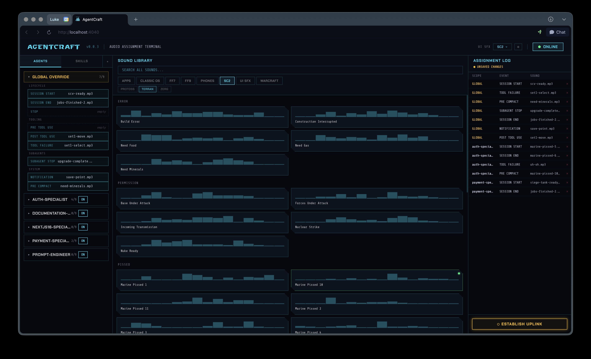

# AgentCraft

Assign sounds to your AI coding agent's lifecycle events. Configure everything through an SC2-inspired dashboard — drag sounds onto hook slots, pick a UI theme, and hear your agents come alive.

Works with **Claude Code** and **OpenCode**.



## How It Works

**1. Run the skill**

From any Claude Code session:

```
/agentcraft
```

**2. Sounds download automatically**

On first launch, AgentCraft clones the [agentcraft-sounds](https://github.com/rohenaz/agentcraft-sounds) library to `~/.agentcraft/sounds/`. No manual setup required.

**3. The dashboard opens at `http://localhost:4040`**

A local web UI starts in the background. It stays running between sessions so subsequent `/agentcraft` calls open instantly.

**4. Assign sounds to hook points and skill calls**

- **AGENTS tab** — Expand **GLOBAL OVERRIDE** or any agent row. Click a hook slot (SESSION START, STOP, TOOL FAILURE, etc.) to enter select mode, then click any sound in the browser to assign it. Or drag a sound card directly onto a slot.
- **SKILLS tab** — Assign sounds to individual skill invocations. Each skill has an **ON INVOKE** and **ON COMPLETE** slot.
- Hit **ESTABLISH UPLINK** to save.

From then on, Claude Code plays your sounds automatically as it works — no dashboard needed.

## Install

```bash
claude plugin install agentcraft@rohenaz
```

## Prerequisites

- [Bun](https://bun.sh) — runs the web UI
- [jq](https://jqlang.github.io/jq/) — JSON parsing in the hook script
- [git](https://git-scm.com) — downloads the sound library on first run
- macOS: `afplay` (built in) · Linux: `paplay` or `aplay`

## Hooks

| Event | When it fires |
|-------|--------------|
| `SessionStart` | New session begins |
| `SessionEnd` | Session ends |
| `Stop` | Claude finishes a response |
| `SubagentStop` | A subagent completes |
| `Notification` | Claude sends a notification |
| `PreCompact` | Context is about to be compacted |
| `PreToolUse (Skill)` | A skill is invoked |
| `PostToolUse (Skill)` | A skill completes |

Sounds can be set globally (fires for all agents) or per-agent (overrides global for that agent).

## UI Sound Themes

The **UI SFX** dropdown in the header controls ambient sounds that play as you use the dashboard. Click **⚙** to customize individual slots per theme.

| Theme | Style |
|-------|-------|
| SC2 | StarCraft II — crisp, digital |
| WC3 | Warcraft III — warm, fantasy |
| FF7 | Final Fantasy VII — retro RPG |
| FF9 | Final Fantasy IX — soft, minimal |
| OFF | No UI sounds |

## Sound Library

Sounds live at `~/.agentcraft/sounds/`. Any `.mp3`, `.wav`, `.ogg`, or `.m4a` file you drop there appears in the browser automatically. To update the library:

```bash
git -C ~/.agentcraft/sounds pull
```

## Storage

| Path | Contents |
|------|----------|
| `~/.agentcraft/assignments.json` | Your sound assignments |
| `~/.agentcraft/sounds/` | Sound library |

## Managing the Plugin

```bash
claude plugin update agentcraft@rohenaz     # Update to latest
claude plugin uninstall agentcraft@rohenaz  # Remove
```
